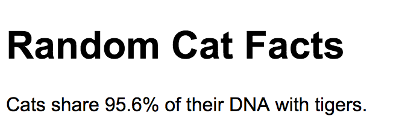

# Random Cat Facts
A quick project that gathers facts from the [Random Fact API page](https://fact.birb.pw/) and places it onto a web page. For the actual facts, click here: [Cat Facts API endpoint](https://fact.birb.pw/api/v1/cat).

## Project preview:

## Resources
* [Math.random()](https://developer.mozilla.org/en-US/docs/Web/JavaScript/Reference/Global_Objects/Math/random)
